# GameOS — a game console for ComputerCraft

A complete console that boots on a ComputerCraft (CC:Tweaked) Advanced
Computer: animated launcher, thirteen finished games, high score tables with
arcade initials, 44 trophies, four palette themes, sound, and a save file that
remembers everything.

It is written against a **square-pixel framebuffer** built on ComputerCraft's
2×3 sub-pixel drawing characters, so the display is effectively **102 × 57
pixels** rather than 51 × 19 text cells. That is what lets Tetris have a real
well, Meteors have real vector rocks, and Bombard have terrain you can blow
holes in.

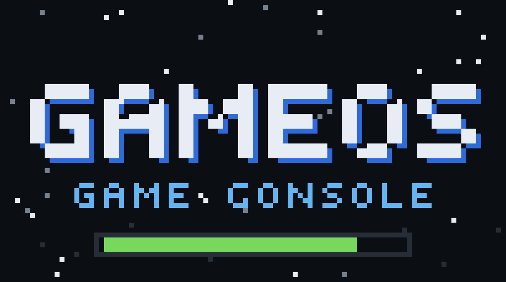

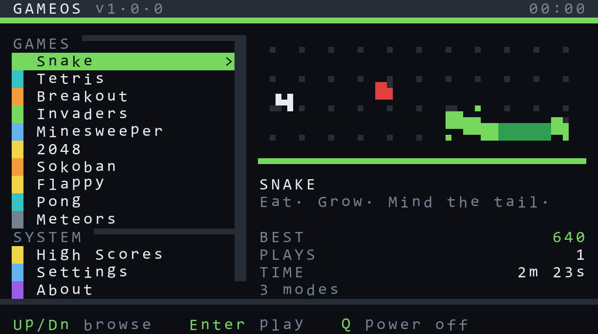

| | |
|---|---|
| 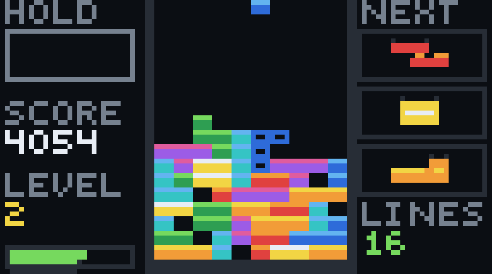 | 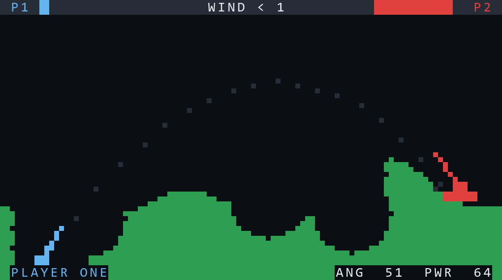 |
| 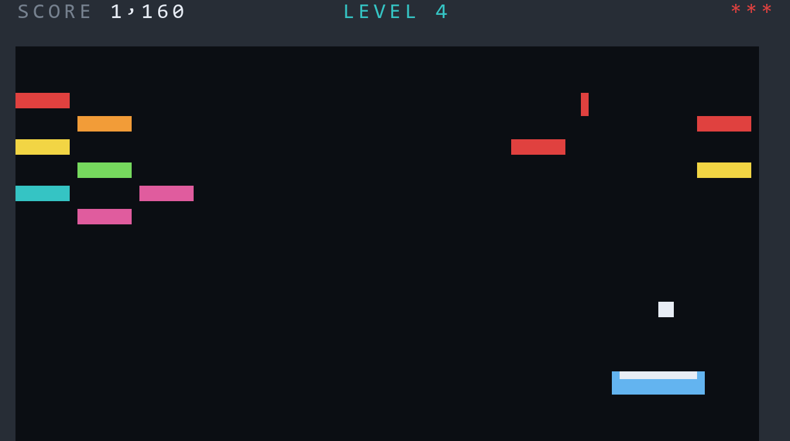 | 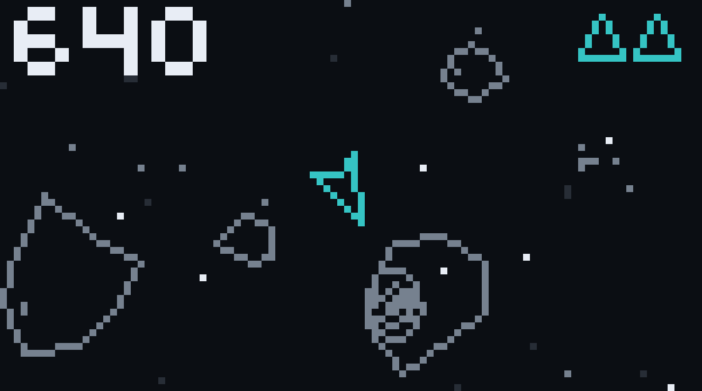 |
| 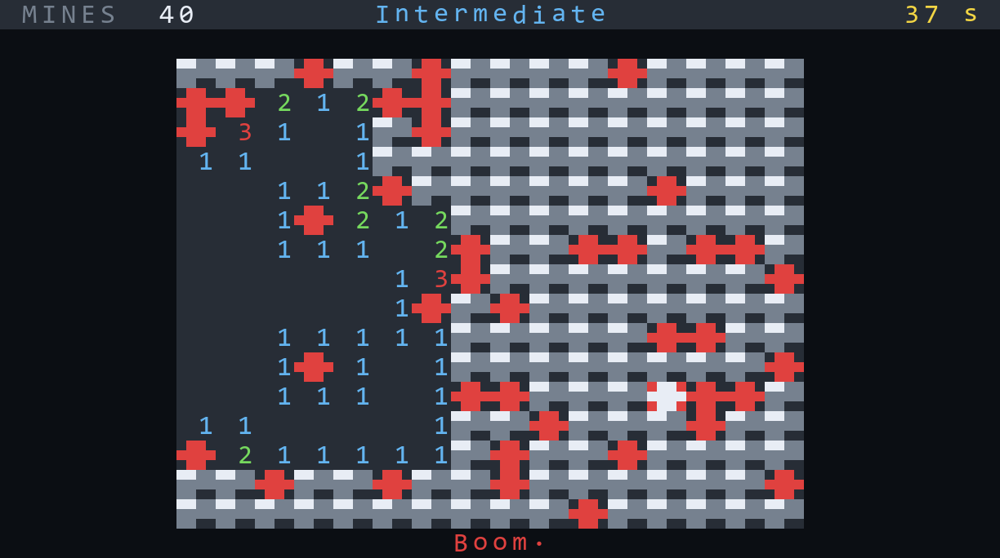 | 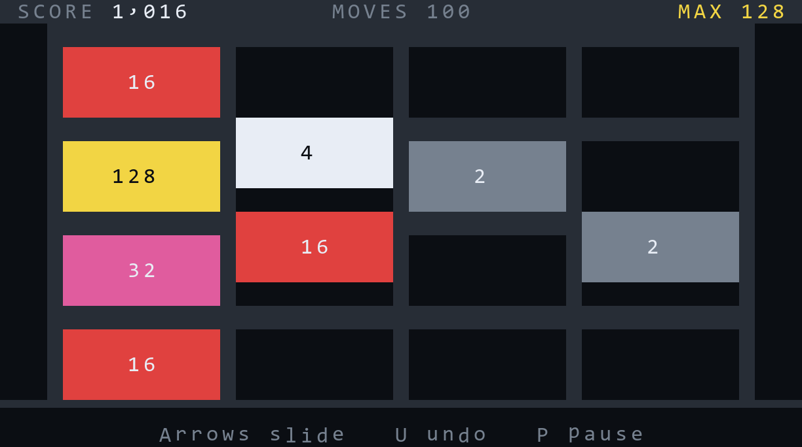 |
| 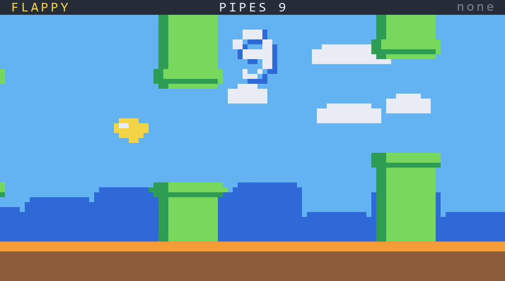 | 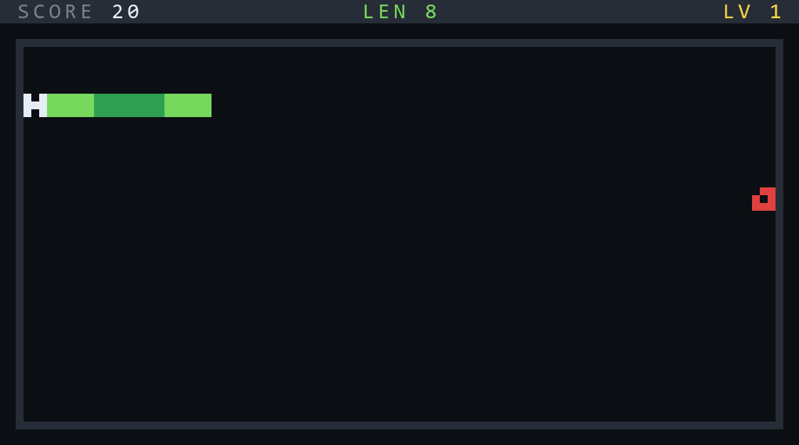 |
| 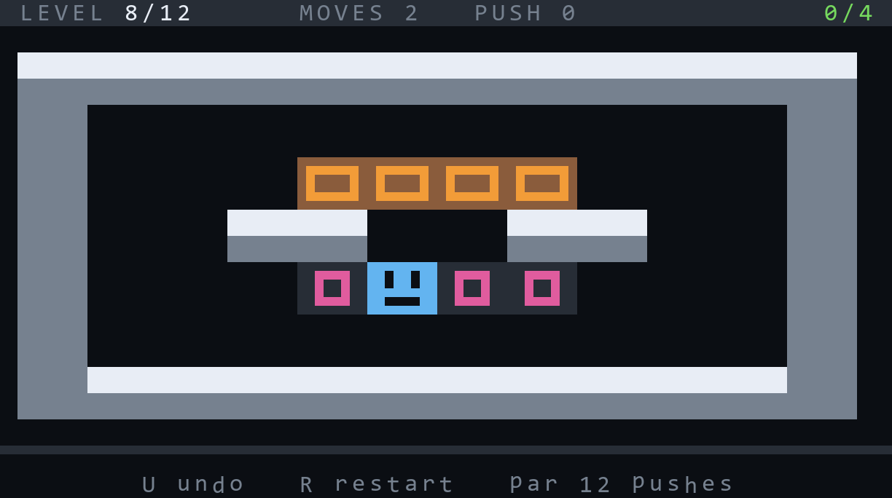 | 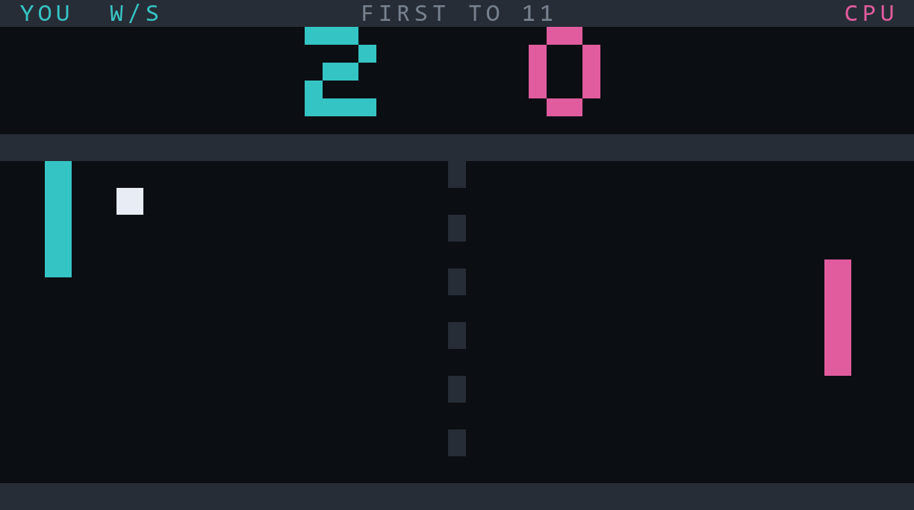 |
| 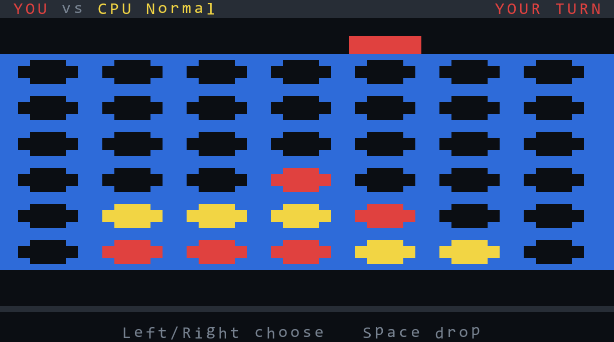 | 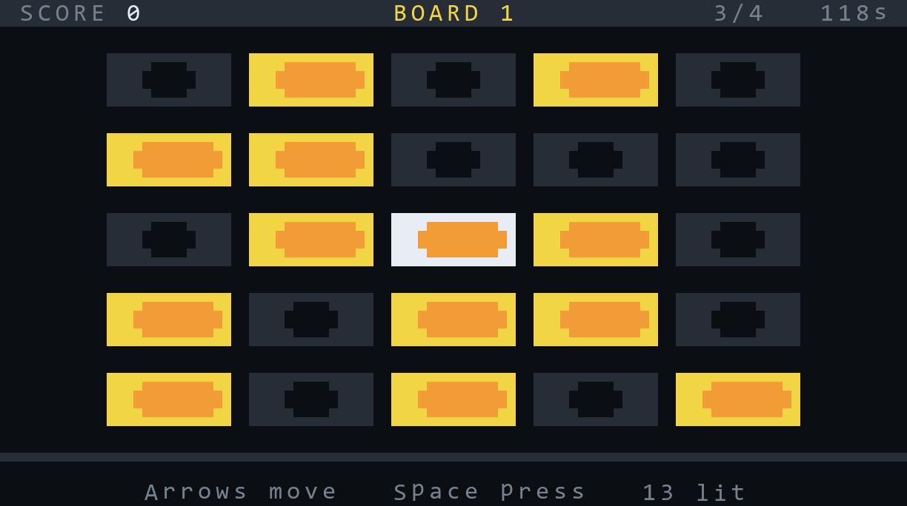 |
| 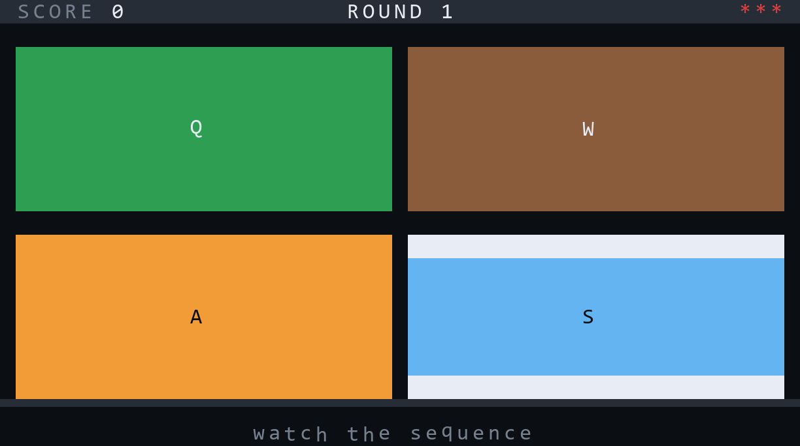 | 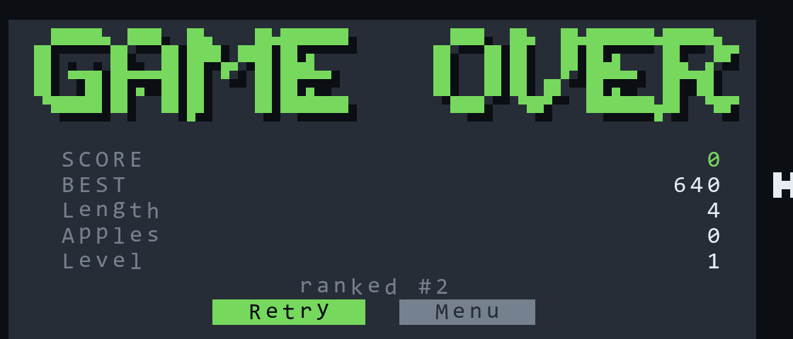 |
| 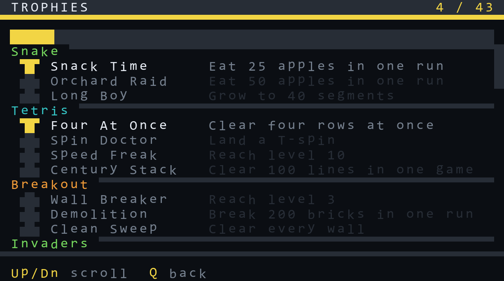 | 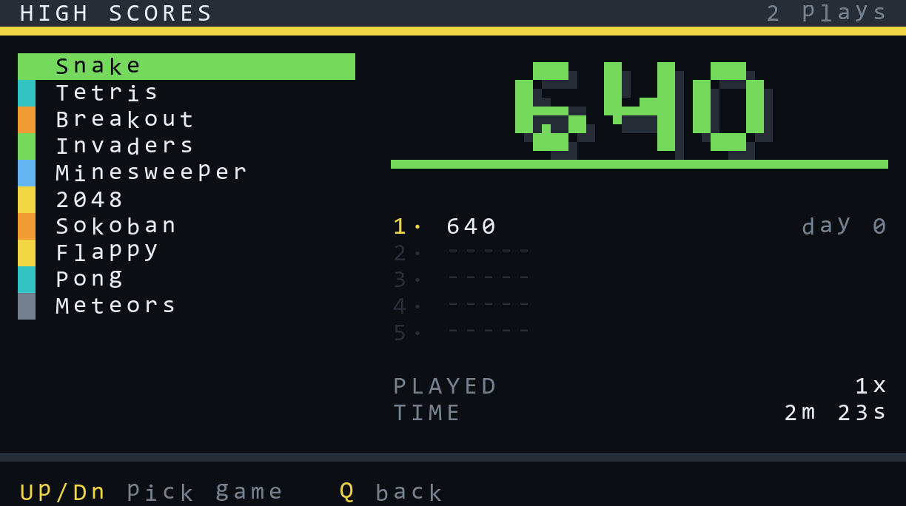 |

The same launcher under the Game Boy palette:

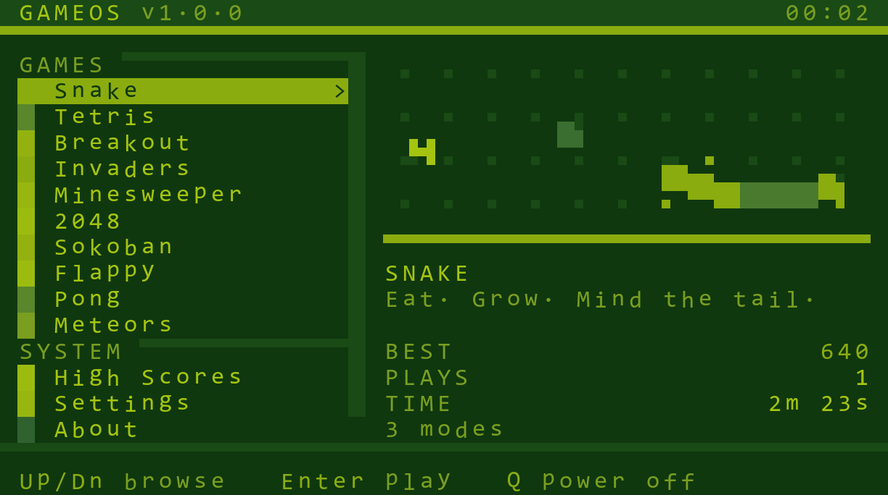

> Every screenshot here was produced by the test harness rendering the real
> terminal output, so they are exactly what the computer shows in game — the
> only difference is the preview font.

---

## Requirements

- **CC:Tweaked** (any recent version — the code targets Lua 5.2, which is what
  ComputerCraft runs).
- An **Advanced Computer** (gold). It gives you the 51×19 colour display and
  mouse support. A basic computer runs everything but in greyscale.
- Optional: a **Speaker** next to the computer for sound effects and music.
- Optional: a **3×3 or larger Advanced Monitor** — run `gameos monitor left`.

The console draws into a fixed 51×19 surface. On a bigger monitor that surface
is centred and the surround is blanked, so every screen lines up exactly.

---

## Install

### Option A — one command (recommended)

Everything is bundled into a single self-extracting file, `install.lua`, which
carries all 30 files inside it. One line in game:

```
wget run https://raw.githubusercontent.com/levisnakes/cc-gameos/main/install.lua
```

If HTTP is disabled on your computer, paste `install.lua` into pastebin.com
instead and run:

```
pastebin get <code> install
install
```

Either way it unpacks the console and tells you to reboot. `install <folder>`
unpacks somewhere else instead of the computer root, and re-running it later
overwrites in place, so that is also how you update.

The bundle is about 279 KB, comfortably inside pastebin's limit.

### Option B — copy the folder (no HTTP needed)

1. Find your world save:
   `.minecraft/saves/<world>/computercraft/computer/<id>/`
   The `<id>` is the number shown by running `id` on the computer.
2. Copy **everything inside `disk/`** into that folder, so you end up with:

```
computer/<id>/startup.lua
computer/<id>/gameos.lua
computer/<id>/gameos/boot.lua
computer/<id>/gameos/lib/...
computer/<id>/gameos/os/...
computer/<id>/gameos/games/...
```

3. Reboot the computer in game. It boots straight into GameOS.

For a server, the same folders live under `world/computercraft/computer/<id>/`.

### Option C — from a disk drive

Put the same files on a floppy (`.../computercraft/disk/<n>/`) and the computer
will run `startup.lua` from the disk.

### Running it manually

`startup.lua` boots the console automatically. Delete it if you would rather
land in the CraftOS shell, then type:

```
gameos                 run on this screen
gameos monitor left    run on an attached monitor
```

To leave GameOS, pick **Power Off** from the menu, press **Q**, or hold
**Ctrl+T**.

---

## The games

| Game | What it is | Modes |
|---|---|---|
| **Snake** | 32×16 board, bonus fruit, speed ramp | Classic / Wrap / Maze |
| **Tetris** | Full modern ruleset: 7-bag, SRS kicks, hold, ghost, lock delay, T-spins, back-to-back, combos | Start at level 1 / 5 / 10 / 15 |
| **Breakout** | 10 hand-built walls, multiball, lasers, 7 power-ups, 3 lives | Start at level 1 / 4 / 7 |
| **Bombard** | Artillery duel over destructible terrain, with wind. Plays the computer, a friend on one keyboard, or **another ComputerCraft console over a modem** | CPU easy/normal/hard, same console, host, join |
| **Minesweeper** | First-click safety, flood reveal, flags, chording | Beginner / Intermediate / Expert |
| **2048** | Standard rules with one-step undo | — |
| **Sokoban** | 12 levels, every one machine-verified solvable, optimal push counts shown as par, unlimited undo | Continue / Level select / Start over |
| **Flappy** | One button, parallax scenery, medals at 10/20/30/40 | Normal / Tight / Insane |
| **Pong** | First to 11, ball speeds up on every rally | CPU easy/normal/hard, or 2 players |
| **Meteors** | Vector asteroids with inertia, wrap-around space, hyperspace, UFO | — |
| **Connect Four** | Alpha-beta opponent with a verified easy/normal/hard ladder | 3 CPU levels, or 2 players |
| **Lights Out** | Every board solvable by construction, against the clock | Gentle / Standard / Tangled |
| **Simon** | Watch, listen, repeat; each panel has its own note | Normal / Fast / Strict |

### Controls

Every game shows its own control card the first time you play it, and again
from the pause menu.

Shared across the console:

| Key | Does |
|---|---|
| Arrows / WASD | Move, navigate |
| Enter / Space | Confirm, launch |
| Q or Backspace | Back / cancel |
| Tab | Jump between the games and system sections |
| **P** | Pause menu (resume, restart, controls, sound, quit) |
| Ctrl+T | Leave the current game |

> ComputerCraft never delivers the **Escape** key to a program — Minecraft
> closes the computer GUI with it — which is why pause is **P**.

---

## Console features

- **Animated cover art.** Every game draws its own live illustration in the
  launcher: the snake slithers after an apple, tetrominoes fall, the asteroid
  rocks tumble.
- **44 trophies** across the thirteen games plus three console-wide ones, with
  a browser that shows what you have and what is still out there. Earning one
  is announced on the game-over card.
- **Arcade initials.** A new number one prompts for three letters, the way it
  should, and they show up in the score table.
- **Four palette themes** — Midnight, Neon, Amber CRT and Game Boy — applied
  by reprogramming the terminal's 16-colour palette. The Game Boy theme turns
  the whole console monochrome green, including the games.
- **High score tables**, top five per game, with a browser screen.
- **Play statistics** — plays and total time per game.
- **Per-game progress** — Sokoban remembers your level and best move counts.
- **Sound.** 113 hand-written effects -- one per action, not one per category
  -- and nine original songs, one per game. A speaker takes eight notes a tick,
  so the engine is a budgeted mixer: effects are scheduled ahead and cost no
  frame time, and music yields its last notes so gameplay feedback is never
  masked. Three independent volume knobs (master, music, effects) and a sound
  test screen to audition everything. Silent no-op with no speaker attached.
- **Screensaver** after 45 idle seconds.
- **Screen transitions** between the launcher and a game.
- **Crash containment** — a game that errors shows a dialog and returns you to
  the menu instead of dumping you at the CraftOS prompt.
- **Mouse support** throughout, including Minesweeper (left reveal, right flag)
  and monitor touch.

---

## How it is built

```
disk/
  startup.lua            boots the console
  gameos.lua             the "gameos" command, handles monitor redirect
  gameos/
    boot.lua             module loader, display bring-up, game discovery
    lib/
      gfx.lua            51x19 surface, palettes, themes, cell drawing
      canvas.lua         102x57 square-pixel framebuffer (the interesting bit)
      font.lua           4x5 pixel font with variable-width M/N/W
      input.lua          key/mouse state, arcade-style auto-repeat
      audio.lua          budgeted mixer, volumes, tracker playback
      sfx.lua            113 effects, built from a small set of shapes
      music.lua          nine original songs in a pattern/order tracker
      data.lua           settings, high scores, progress, stats
      ui.lua             modal dialogs, pickers, transitions, name entry
      runtime.lua        the game loop, pause menu, trophies, game-over card
    os/
      splash.lua         boot animation
      shell.lua          the launcher
      settings.lua scores.lua trophies.lua soundtest.lua about.lua
    games/               one file per game, auto-discovered at boot
```

### The pixel canvas

ComputerCraft's font includes 32 characters (128–159) that draw a 2×3 grid of
sub-pixels. A character cell can carry **two colours**, so each cell encodes
six pixels as a bit pattern plus a foreground and background colour. Bit 32
has no character of its own, so patterns that set it are stored inverted with
the two colours swapped.

`canvas.lua` gives you a plain `set(x, y, colour)` framebuffer over that, and
resolves each cell at render time by keeping its two most common colours.

The same trick works without a full framebuffer: `gfx.makeGlyph` compiles a
block of `#` and `.` rows into drawing characters once, and `gfx.blitGlyph`
stamps it anywhere on the character grid in any two colours. That is where the
Minesweeper mines and flags, the Sokoban crates, the Connect Four discs and the
Lights Out lamps come from.

The one rule this imposes: **a cell can only show two colours.** Two design
conventions keep everything crisp:

- Align art to the cell grid — odd x, and y = 3k + 1 — so a game object never
  shares a cell with a differently-coloured neighbour. Tetris blocks are 4×3
  pixels, which is exactly two cells wide and one tall, so the well renders
  pixel-perfect.
- Put text baselines on y = 3k + 1 and leave six pixels between lines.

### Sound

A ComputerCraft speaker gives you sixteen instruments, two octaves of pitch,
and **eight notes per tick**. That last number is the whole design constraint,
so `audio.lua` is a budgeted mixer rather than a pile of `playNote` calls:

- **Effects are scheduled, not played.** An effect is a list of
  `{delay, instrument, pitch, volume}` events; the engine fires them when they
  come due, so a nine-note explosion costs the same at the point of impact as
  a click.
- **Music yields.** The tracker reserves the last few notes of every tick for
  effects, so the soundtrack can never drown out the feedback that tells you
  what just happened.
- **Three knobs.** Master, music and effects scale independently into the
  speaker's 0..3 range.

`sfx.lua` holds 113 effects built from seven shapes — `blip`, `rise`, `fall`,
`stab`, `chord`, `roll`, `thump` — so a new sound is usually one line:

```lua
M["mygame.win"] = rise("bell", "D4", "D5", 5, 0.06, 0.45)
```

Games can shift a sound's pitch at the call site, which is how Breakout plays
a scale as the wall comes down and Pong's rally audibly tightens:

```lua
audio.play("brk.brick", (ROWS - row) * 2)
```

`music.lua` holds nine original songs in a small tracker format: sixteen-row
patterns, an order list, and tempo in ticks per row.

```lua
song("mytheme", {
  tempo = 3,                      -- 0.15s per row
  order = { "a", "a", "b", "a" },
  patterns = {
    a = {
      { "pling", 0.42, "D4 .  A4 .  F4 .  A4 .  D5 .  A4 .  C5 .  A4 ." },
      { "bass",  0.50, "D4 .  .  .  .  .  .  .  A3 .  .  .  .  .  .  ." },
    },
  },
})
```

A game picks its soundtrack with `music = "mytheme"` in its definition, or
`music = false` to run in silence — which is what Simon does, because there
the sequence *is* the puzzle.

Everything sits inside F#3 to F#5, the speaker's real range. The suite fails
on a note outside it, an instrument that does not exist, an `audio.play` name
that is not defined, or anything that would ask the speaker for a ninth note
in a tick.

### Adding a game

Drop a file in `gameos/games/`. It is discovered at boot. The contract:

```lua
local req = ...
local gfx = req("lib.gfx")

local Game = {}
Game.__index = Game

local function new(api, mode)
  local self = setmetatable({}, Game)
  self.c = api.canvas.new(1, 2, gfx.W, 18, colors.black)
  self.score = 0
  self.finished = false
  return self
end

function Game:update(dt) end          -- required
function Game:draw() end              -- required
function Game:onKey(code, held) end   -- optional
function Game:onMouse(kind, btn, x, y) end
function Game:summary() return { { "Label", value } } end

return {
  id = "mygame", name = "My Game", tagline = "Short pitch",
  accent = colors.lime, order = 110,
  cover = function(canvas, t) end,    -- animated launcher art
  controls = { { "Arrows", "Move" }, { "P", "Pause menu" } },
  modes = { { id = "normal", name = "Normal", hint = "" } },
  trophies = {
    { id = "mygame_win", name = "First Blood", desc = "Win once",
      test = function(inst) return inst.won end },
  },
  new = new,
}
```

The runtime handles the frame loop, pause, crashes, scoring and the game-over
card. Set `self.finished = true` when the run ends; set `self.won = true` if
they won.

---

## Testing

Everything here was executed and screenshotted before shipping. The harness in
`tools/` runs the real disk image inside a Lua 5.4 VM against a mock of the
CC:Tweaked API — buffered terminals, windows, palettes, the event loop, a
virtual clock and a recording speaker.

```
cd tools
npm install
bash test.sh
```

What it covers:

- **Static lint** — rejects non-ASCII bytes and anything that differs between
  Lua 5.2 (ComputerCraft) and 5.4 (the test VM): `//`, bitwise operators,
  `math.atan2`, `math.pow`, `unpack`, `setfenv`, and friends.
- **Canvas and font** — exact assertions on the emitted drawing characters and
  blit colours, including the three-colours-in-one-cell fallback.
- **Game rules** — Tetris line clears, tetris scoring, wall kicks for all eight
  rotation transitions, hold lockout, hard drop; 2048 merge order and undo;
  Snake growth and wall/wrap behaviour; Minesweeper first-click safety, win and
  loss; Sokoban scripted solve; Breakout brick durability; Pong match end.
- **Input fuzz** — every game in every mode driven with random keys and clicks
  for 600 frames, asserting no crash.
- **End to end** — boots the console, browses the launcher, plays Snake through
  to the game-over card, quits, and powers off.
- **The installer** — the single-file bundle is rebuilt, unpacked into an
  empty filesystem, checked byte-for-byte against the sources, and then booted,
  so a stale or broken bundle fails the suite.
- **Sokoban level verification** — a BFS solver with deadlock pruning proves
  all 12 levels are solvable and computes the optimal push count used as par.
- **Opponent quality** — the Connect Four AI is checked for taking free wins,
  blocking threats and capping vertical threes, and the three difficulties are
  played off against the same reference opponent over all seven openings to
  prove the ladder is real rather than nominal.
- **The sound system** — every effect and song is checked for valid
  instruments and in-range notes, every `audio.play` call site is resolved
  against the effect table so a typo cannot ship, the volume knobs are proved
  to silence and restore their channels, and the whole thing is driven with
  music plus effect spam to prove it never asks the speaker for more than the
  eight notes a tick it can take.
- **Rendering budget** — every game is measured for pixel writes, cell
  resolutions and characters pushed per frame, and the suite fails if the
  worst case leaves the budget.

`python render.py out/<name>.shots` turns any captured frame into a PNG that
matches how ComputerCraft actually draws it, including exact sub-pixel
characters — which is how the layout bugs in this project were found.

---

## Notes and limits

- **Measured cost.** The heaviest game (Flappy, a full-screen scrolling scene)
  works out at roughly 21,000 operations per frame, about 420,000 per second at
  20 FPS. The cell-based games are two orders of magnitude cheaper. The console
  uses a fixed timestep, so logic stays correct even if a busy server drops
  frames, and there is a frame counter in Settings.
- The Connect Four search is capped by measured node counts, not guesswork:
  about 600 nodes at depth 4 and 5,000 in the worst mid-game case at depth 5.
- **This has never been run inside Minecraft.** Everything was executed and
  screenshotted against a mock of the CC:Tweaked API, which is faithful enough
  to have caught real bugs, but it is still a mock. The things it cannot prove
  are the true frame rate on a busy server, how the real ComputerCraft font
  looks (the preview renderer substitutes a monospace font for ASCII), and
  speaker timing.
- Pocket computers are not supported — their screen is 26×20, narrower than the
  51 columns the console needs.
- The save file lives at `/gameos/data/save.dat`. If the disk is read-only the
  console still runs, it just cannot remember anything; the About screen says
  so.
